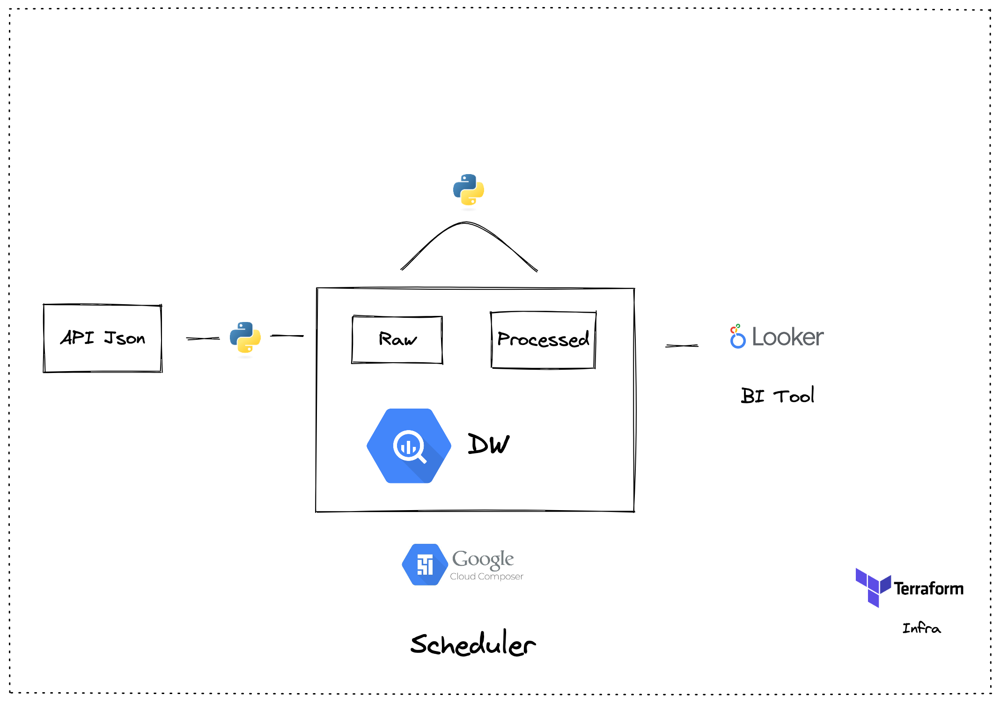

# Arquitetura google proposta

##  Camada de extração

A camada de extração pode ser feita via Python, fazendo o parse do json e transformando - o para uma estrutura relacional

## Camada de transformação

A camada de transformação pode ser via Python, para fazer as modificações necessárias (Tipagem)

## Camada de armazenamento

A camada de armazenamento pode ser usada pelo BigQuery, onde podemos definir dois schemas:

**Raw**: Schema para receber o dado não tratado, apenas no modelo relacional parseado pelo extrator

**Processed**: Schema para receber o dado com algum tipo de tratamento, caso de tipagem de colunas, alguma transformação que venha a ter.

## Camada de Gerenciamento

Poderiamos usar o google cloud composer para agendar as dags que iremos construir através dos scripts pythons.

## Camada de visualização

Podemos usar o looker para ler diretamente do schema **Processed** para os analistas realizarem seus dashboards e gráficos

## Camada de Infra

Todos os serviços do google cloud poderiam ser gerenciados e versionados usando o **Terraform**

